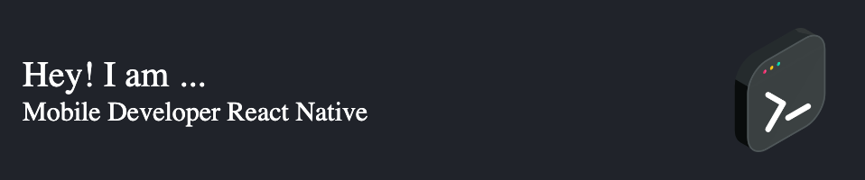

## 💫 About Me:

From a very early age, I was passionate about mathematics and problem-solving. Later on, this aspect would influence my career choice and ultimately my professional vocation. I am a software developer passionate about the pursuit of knowledge, not only in new technologies but also in methods, concepts, and programming paradigms. I tend to be very self-taught and enjoy understanding how things work underneath.  Currently, I have solid experience in creating, maintaining, testing, and deploying mobile applications. However, in the long term, I aspire to become a software architect. 

## 🌐 Socials:

## 💻 Tech Stack:

            

## 📊 GitHub Stats:

 
 

## 📈 GitHub Contribution:

  

